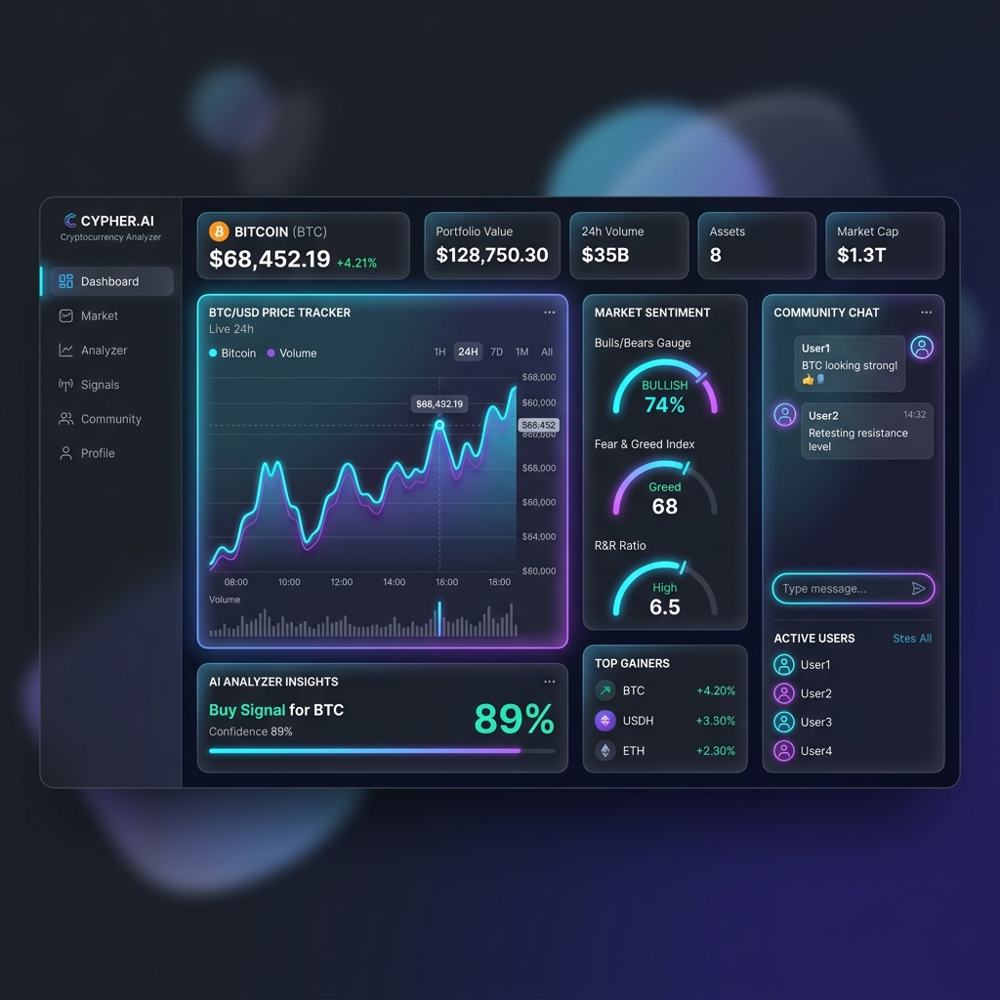
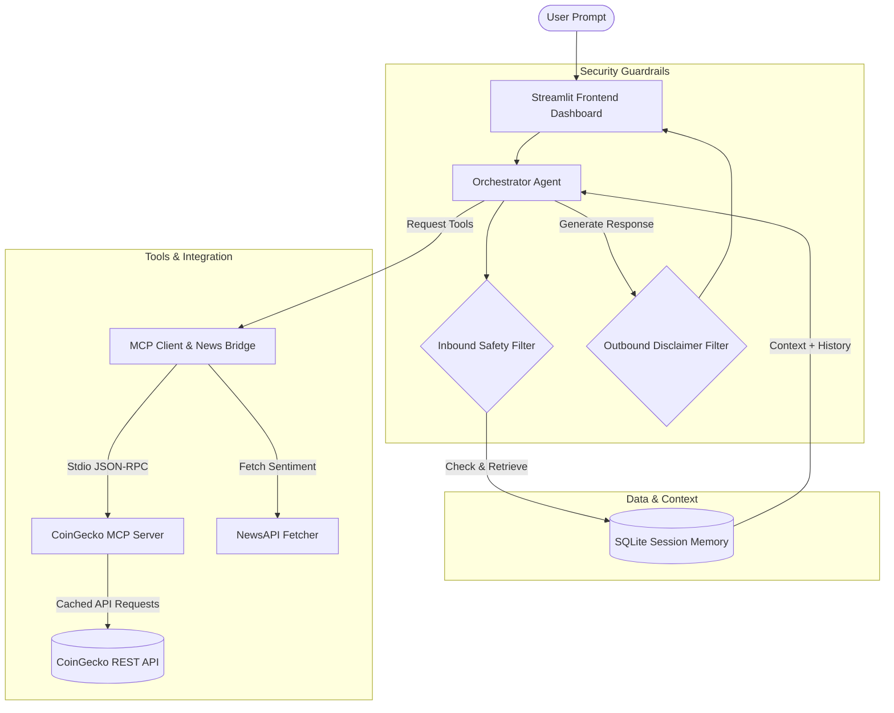
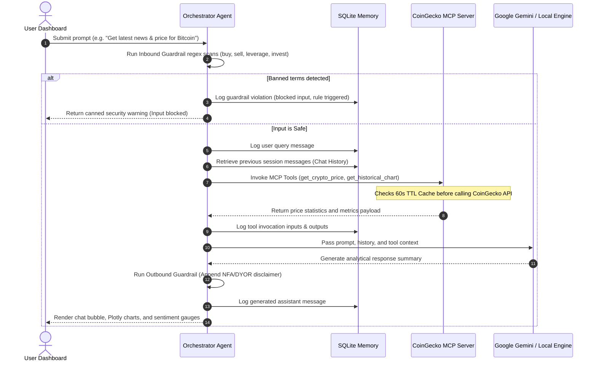
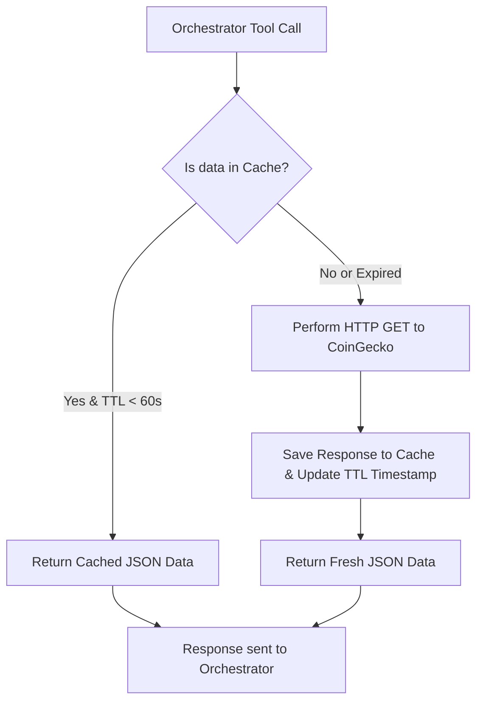

# Cryptocurrency Price & Sentiment Analyzer (Kaggle Capstone)



An agentic, security-first cryptocurrency analysis assistant designed to track real-time price trends and reconcile market news sentiment. Built with a Python-based Model Context Protocol (MCP) server for CoinGecko API data, SQLite-backed session persistence, strict financial guardrails, and a glassmorphic Streamlit workspace dashboard.

---

## 🚀 Key Features
- **CoinGecko MCP Server**: Implements standard Model Context Protocol via Stdio, providing structured tools for price, metrics, market search, and historical charts. Includes a **60s TTL Cache** to prevent rate limiting (429 errors).
- **SQLite Session Memory**: Preserves chat histories, tool inputs/outputs, and security violations inside a local SQLite database for full execution auditing.
- **Strict Financial Guardrails**: 
  - **Inbound Filter**: Block transaction execution commands ("buy", "sell", "trade", "leverage", "invest") and personal asset recommendations.
  - **Outbound Filter**: Automatically appends a prominent, non-obtrusive financial disclaimer (NFA/DYOR).
- **Explainable UI**: Streamlit dashboard with a real-time price trend chart (Plotly), sentiment gauges, live chat, and a database viewer showing raw database records for grading transparency.
- **Local Fallback Mode**: If Google Gemini API keys are not supplied, the orchestrator automatically boots in local rules-engine fallback mode so the dashboard, charts, and SQLite logging remain fully testable.

---

## 📊 System Architecture & Workflows

The application follows a strict modular structure dividing the dashboard, the agent orchestrator, security filters, and the MCP client/server layers.

### 1. High-Level Architecture
The diagram below illustrates the relationship between the Streamlit Frontend, Orchestrator, SQLite Database, and the CoinGecko MCP Server.



---

### 2. Agent Query Execution Workflow
When a user submits a query to the chat terminal, the system processes it through multiple phases before displaying the response:



---

### 3. CoinGecko MCP Server & TTL Caching Flow
To stay within CoinGecko's Demo API limits (30 requests/minute), a 60-second Time-To-Live (TTL) memory cache interceptor protects all external network requests.



---

## 🛠️ Installation & Setup

1. **Navigate to the workspace**:
   ```bash
   cd "d:\capstone project"
   ```

2. **Install core dependencies**:
   ```bash
   pip install -r requirements.txt
   ```

3. **Configure Environment Variables**:
   Create a `.env` file from the example template:
   ```bash
   cp .env.example .env
   ```
   Open `.env` and fill in your keys:
   - `GEMINI_API_KEY`: Your Google Gemini API Key.
   - `NEWS_API_KEY`: Your NewsAPI key (required for live sentiment analysis).
   - `COINGECKO_API_KEY`: (Optional) Demo/Pro key if you have one. Leave blank to use the free tier.

---

## 🏃 Running the Application

Start the Streamlit dashboard:
```bash
streamlit run app/ui.py
```
This command automatically manages the lifecycles of the frontend interface, the local SQLite database creation (`data/database.sqlite`), and connects to the background CoinGecko MCP server.

---

## 🧪 Running Automated Tests

A comprehensive suite of unit tests is included in the `tests/` directory to verify SQLite queries, guardrail filters, and mock client API responses:

```bash
python -m unittest discover -s tests
```

---

## 📁 Repository Layout

```text
├── .env                         # Active API keys config
├── requirements.txt             # Primary Python dependencies
├── plan.md                      # Detailed capstone roadmap & milestones
├── README.md                    # Project run guide (this file)
│
├── docs/                        # Project Documentation
│   └── crypto_analyzer_dashboard.png # Premium dashboard mockup image
│
├── mcp_server/                  # CoinGecko MCP Server
│   ├── server.py                # Defines Stdio FastMCP tools
│   ├── coingecko_client.py      # Caching CoinGecko REST client
│   └── requirements.txt         # Server dependencies
│
├── agent/                       # Core Orchestrator & Guardrails
│   ├── memory.py                # SQLite database manager
│   ├── guardrails.py            # Inbound/Outbound security bounds
│   ├── prompts.py               # Prompt templates & system instructions
│   ├── tools.py                 # News fetcher and MCP Client stdio bridge
│   └── orchestrator.py          # Main coordinator loop & LLM integration
│
├── app/                         # Streamlit Interface
│   ├── ui.py                    # Dashboard page layout & tabs
│   └── style.css                # Premium Glassmorphism styling sheets
│
├── tests/                       # Automated Verification Suite
│   ├── test_memory.py           # Validates SQL schemas and records
│   ├── test_guardrails.py       # Validates that banned prompts are blocked
│   └── test_mcp_server.py       # Validates CoinGecko tool endpoints
│
└── data/                        # Database Storage
    └── database.sqlite          # Local SQLite session memory database
```
